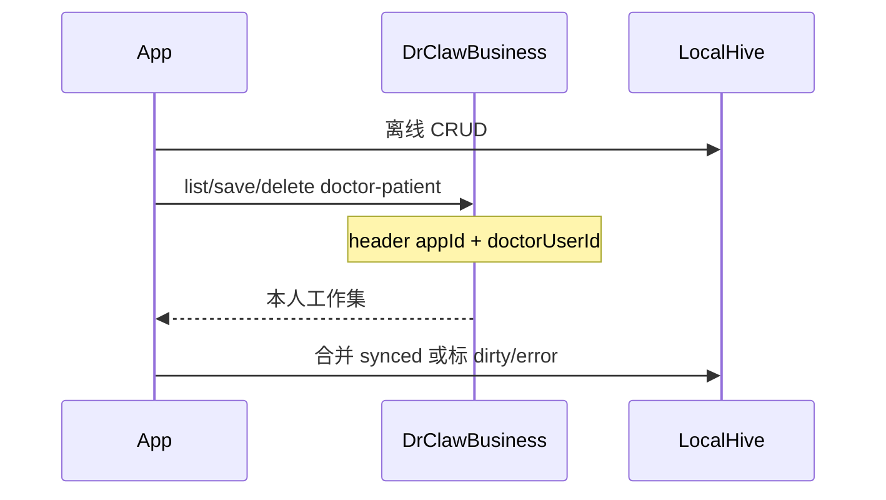
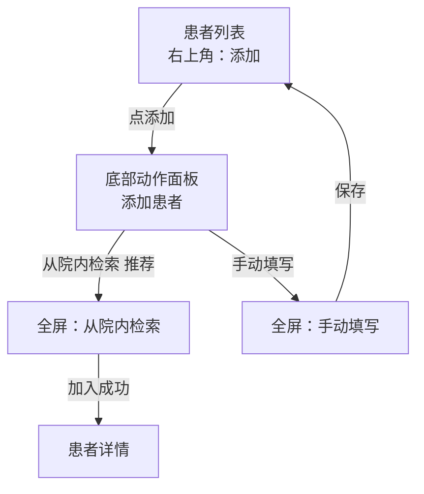
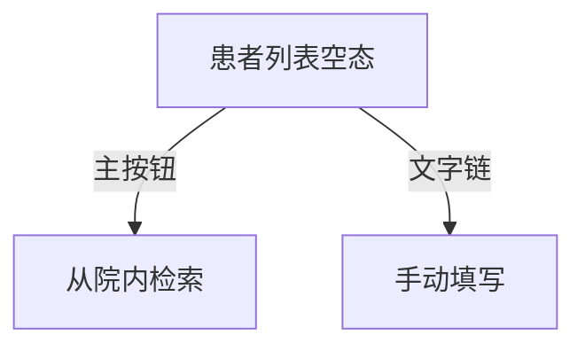

# 业务工作台（business_workbench）详细设计

> 状态：**P0 / P1 / P2a / P2b 已落地**；P2c 待实施（细则见 **§15**；双轨总览见 §14）  
> 范围：[DrClawApp](../) — 主工程仅挂载 Tab；**业务实现独立本地包 `business_workbench`**  
> 关联：查房「床旁录音 → 发给 Agent → Business 暂存 → HIS 回填」闭环；Business 患者字段对齐 `PatientDTO`

---

## 1. 背景与目标

### 1.1 业务场景

1. **病房（床旁）**：医生在 App **业务工作台**选择患者 → 长录音 → 多位患者录完后，**单条**将录音发给 Agent；Agent 生成查房文书，审核提交后写入 Business。  
2. **值班室（HIS）**：电子病历「获取查房记录」拉取 Business 文书并回填（本设计不改 HIS / Business API）。

### 1.2 产品与架构原则

| 原则 | 说明 |
|------|------|
| 基础 Tab 冻结 | 「会话 / 通讯录 / 我的」为 IM 基础能力，**不扩展医疗业务** |
| **业务工作台主入口** | 底部 **业务工作台** Tab；独立包 `business_workbench`，作为与 **DrClawBusiness** 交互的业务能力主入口与扩展点 |
| **业务包解耦** | 患者、录音及后续 Business 相关能力均在 path 包内；主工程只做壳 + Host（IM / 后续 Business API）适配 |
| MVP 发送 | 支持**批量录音（本地多条）**；发给 Agent **仅单条发送** |
| **长录音投递** | 以 OpenIM **文件消息（105）** 发送，不用语音（103），避免超长音频受短语音限制 |
| **发送导航** | P0 **暂定**：发送时进入与助手的聊天页再投递（后续可改为后台发送、留在列表） |
| **数据隔离** | App 侧患者工作集、备注、录音均属**当前登录医生私有**（按 OpenIM userID 分库）；换账号互不可见、不上送他人 |
| **患者双轨** | **医生工作集**写入 Business（按医生归属，私有）；**院级患者信息**经 Business **只读查询接口直连数据底座**，App 不写底座 |

### 1.3 本期目标（MVP）

- [ ] 新建本地包 `business_workbench`，主工程 `pubspec` path 依赖  
- [ ] 底部增加「业务工作台」Tab；壳在主工程，页面来自业务包  
- [ ] 通过 Host 接口注入 IM 发送能力（主工程实现，业务包不直接依赖 ChatLogic）  
- [ ] 患者本地 CRUD（字段对齐 Business）  
- [ ] 选患者长录音 → 本地录音列表  
- [ ] 录音详情 →「发给助手」单条发送（患者上下文 + 音频）  

### 1.4 非目标（本期不做）

- 多选批量发送给 Agent  
- App 直写数据底座或改写院级主档（仅经 **只读查询** 接口查阅）  
- App 直连 Business 写文书（文书由 Agent 写入）  
- Agent 查房 Skill / MCP 落库（Agent 仓另立任务）  
- HIS 回填 UI  
- 改会话 / 通讯录 / 我的既有业务逻辑  
- 业务包反向依赖主工程 `lib/`（禁止）  

---

## 2. 包拆分与依赖边界

### 2.1 为什么拆包

- 本模块定位为 **与 DrClawBusiness 对齐的业务域**（医生工作集、底座只读查询、文书上下文、检验检查查阅等），会持续增长；不宜堆在 IM 的 `lib/pages/`。  
- 命名 `business_workbench` 明确边界：IM 壳 vs Business 业务工作台。  
- 对齐现有 path 包模式：`openim_common`、`openim_live`。  
- 主工程保持「IM 壳 + Host 装配」；业务包可独立演进与测试。

### 2.2 与 Business / Agent 的关系

| 方向 | MVP | 后续 |
|------|-----|------|
| App → Agent（OpenIM） | 【查房录音】文本 + **文件 105**；进聊天页发送 | custom、后台发送等 |
| App ↔ Business（医生工作集） | P0 仅本地 | **P2** 工作集保存/列表（按医生归属，§14.A） |
| App ← Business ← 数据底座 | P0 不直连 | **P2** 只读查询院级患者（§14.B）；P3+ 检验/检查 |
| App → Business（文书） | 不直写；由 Agent MCP 写文书 | — |
| HIS → Business | 已有拉取**文书** API | — |

Host 可拆为两类能力（实施时可一个类实现）：

- `WorkbenchImHost`：开聊、发文本/语音（对接 OpenIM）  
- `WorkbenchBusinessHost`（P2+）：Business baseUrl、鉴权、患者/文书 API  

MVP 仅实现 IM 侧 Host 即可。

### 2.3 包拓扑

```
drclaw (主工程 lib/)
  ├── 依赖 openim_common / openim_live / business_workbench
  ├── Home Tab：嵌入 WorkbenchPage（来自业务包）
  └── 实现 WorkbenchHost（IM 跳转、发文本/语音、botUserId）

business_workbench/          ← 新建 path 包
  ├── 依赖：flutter、get、hive、record、path_provider…
  ├── 可选依赖：openim_common（仅 Styles / TitleBar / 通用组件）
  ├── 禁止依赖：主工程 lib/、openim_live（无必要）
  └── 通过抽象 Host 访问 IM，推荐不直接依赖 flutter_openim_sdk

openim_common/
  └── 不依赖 business_workbench（单向：业务 → 公共，不可反向）
```

依赖方向（允许）：

```
主工程 → business_workbench → openim_common
主工程 → openim_common
主工程 → openim_live → openim_common
```

禁止：

```
business_workbench → 主工程 lib/
openim_common → business_workbench
```

### 2.4 Host 适配（反转依赖）

业务包定义接口，主工程在启动/登录后注入实现。

```dart
/// 位于 business_workbench，业务侧只依赖此抽象
abstract class WorkbenchHost {
  /// 查房投递目标：普通 OpenIM 用户（与好友无异；非编译期 bot 配置）
  String get assistantUserId;

  /// 当前登录用户 OpenIM userID（本地分库用）；未登录为空
  String get currentUserId;

  /// 从好友中选择/更换助手
  Future<String?> pickAssistantUser();

  /// 打开与助手的单聊（无会话则创建）；P0 发送前会调用，进入聊天页
  Future<void> openAgentChat();

  /// 向当前助手会话发送文本
  Future<void> sendTextToAgent(String text);

  /// 向当前助手会话发送本地**文件**（长录音用 105，非语音 103）
  Future<void> sendFileToAgent({
    required String filePath,
    required String fileName,
  });
}
```

主工程实现示例职责：

| 方法 | 主工程怎么做 |
|------|----------------|
| `assistantUserId` | 读 `DataSp`（按医生账号记住所选好友） |
| `pickAssistantUser` | 好友列表选择并写入 DataSp |
| `currentUserId` | 当前 IM 登录 userID |
| `openAgentChat` | 未选则先选好友；`toChat` / `startChat`，**进入聊天页** |
| `sendTextToAgent` | `createTextMessage` + send |
| `sendFileToAgent` | `createFileMessageFromFullPath` + send（长录音） |

> P0 **不提供** `sendSoundToAgent` 给工作台长录音；聊天里按住说话仍走原有短语音逻辑，与工作台无关。

装配：

```dart
// 主工程 HomeBinding / 登录后
Get.put<WorkbenchHost>(AppBusinessWorkbenchHost(), permanent: true);
// 或 WorkbenchModule.init(host: AppBusinessWorkbenchHost());
```

业务包内「发给助手」只调用 `Get.find<WorkbenchHost>()`（或构造注入），**零引用** `chat_logic.dart`。

### 2.5 路由归属

| 层级 | 归属 |
|------|------|
| Tab 根嵌入 | 主工程 `home_view` 增加 Tab，`screen: WorkbenchPage()`（export 自业务包） |
| `/workbench/...` 子路由 | **业务包**提供 `WorkbenchPages.routes`；主工程 `AppPages.routes` **展开合并** |
| 导航 API | 业务包内 `WorkbenchNavigator`；主工程无需为每个子页写死跳转 |

### 2.6 资源与多语言

| 项 | 建议 |
|----|------|
| 业务文案 | 业务包自有文案模块；主工程 `Get.addTranslations` 合并（若需要） |
| 主工程仅改 | `StrRes.workbench` →「业务工作台」；英文 `Business Workbench`；Tab 图标仍用 `homeTab3*` |
| 业务图标 | 包内 `assets/`，在包 `pubspec` 声明 |

### 2.7 包目录（实施骨架）

```
DrClawApp/
├── lib/                          # IM 壳：home 挂 Tab + AppBusinessWorkbenchHost
├── openim_common/
├── openim_live/
├── business_workbench/           # 新建
│   ├── pubspec.yaml
│   ├── lib/
│   │   ├── business_workbench.dart         # export 入口
│   │   ├── host/workbench_host.dart        # 抽象 Host（IM；P2+ 可扩 Business）
│   │   ├── workbench_module.dart           # init / routes
│   │   ├── pages/
│   │   │   ├── shell/                      # Tab 根：入口宫格
│   │   │   ├── patients/
│   │   │   └── recordings/
│   │   ├── models/
│   │   ├── store/
│   │   ├── services/                       # 录音器等（不含 IM SDK）
│   │   └── l10n/
│   └── test/
└── docs/business_workbench_design.md
```

主工程 `pubspec.yaml`：

```yaml
dependencies:
  business_workbench:
    path: business_workbench
```

---

## 3. 信息架构与导航

### 3.1 底部 Tab 调整

当前（3 Tab）：

```
[会话 Dr.Claw]  [通讯录]  [我的]
```

目标（4 Tab）：

```
[会话]  [通讯录]  [业务工作台]  [我的]
```

| 顺序 | Tab | 页面 | 职责 | 代码位置 |
|------|-----|------|------|----------|
| 0 | 会话 | `ConversationPage` | IM 会话（不变） | 主工程 |
| 1 | 通讯录 | `ContactsPage` | 好友/群（不变） | 主工程 |
| 2 | **业务工作台** | `WorkbenchPage` | 业务入口 | **业务包** |
| 3 | 我的 | `MinePage` | 账号（不变） | 主工程 |

主工程改动面尽量小：

- `home_view.dart`：插入 Tab，`import 'package:business_workbench/business_workbench.dart'`  
- `HomeBinding`：调用 `WorkbenchModule.ensureRegistered()`（如需要）  
- 文案：`workbench` →「业务工作台」/ `Business Workbench`  

### 3.2 工作台内导航

```
WorkbenchPage（入口宫格/列表）          ← business_workbench
  ├─ PatientListPage
  │    ├─ PatientEditPage
  │    └─ PatientDetailPage
  ├─ RecordingListPage
  │    └─ RecordingDetailPage          ←「发给助手」→ WorkbenchHost
  └─ RecordingSessionPage
```

### 3.3 入口注册表（扩展点）

仍在业务包内维护；新增业务能力 = 包内加入口 + 页面，主工程 Tab 无需改。

```dart
class WorkbenchEntry {
  final String id;
  final String title;
  final String? iconAsset;
  final String routeName;
  final bool enabled;
}
```

| 入口 id | 标题 | MVP |
|---------|------|-----|
| `patients` | 患者管理 | ✓ |
| `ward_recordings` | 查房录音 | ✓ |
| （预留） | 文书草稿箱、待办等 | ✗ |

---

## 4. 端到端流程（MVP）

```
┌────────────── 病房 · 业务工作台（business_workbench）────┐
│ 1. 患者管理：本地维护                                │
│ 2. 选患者 → 长录音 → 本地保存                        │
│ 3. 单条「发给助手」→ openAgentChat（进聊天页）→ 文本 + 文件(105) │
└─────────────────────┬──────────────────────────────┘
                      │ OpenIM（101 文本 + 105 文件）
┌─────────────────────▼──────────────────────────────┐
│ Agent 转写文件 →（后续）Business → HIS 回填          │
└────────────────────────────────────────────────────┘
```

---

## 5. 数据模型

本地为主；字段命名与 Business `PatientDTO` 对齐。模型与 Hive **全部在业务包内**。

### 5.1 患者 `LocalPatient`

| 字段 | 类型 | 必填 | 说明 |
|------|------|------|------|
| `localId` | string (uuid) | ✓ | 本地主键 |
| `patientId` | string | 建议 | 院内患者 ID |
| `eventNo` | string | 建议 | 就诊号；与 patientId 至少一个有值 |
| `patientName` | string | ✓ | 姓名 |
| `idCard` | string | | |
| `gender` | int/enum | | 对齐 Business Gender |
| `age` | int | | |
| `department` | string | | |
| `bedNumber` | string | | 列表主展示 |
| `remark` | string | | |
| `createdAt` / `updatedAt` | int (ms) | ✓ | |
| `deleted` | bool | ✓ | 软删 |

### 5.2 录音 `LocalRecording`

| 字段 | 类型 | 必填 | 说明 |
|------|------|------|------|
| `localId` | string (uuid) | ✓ | |
| `patientLocalId` | string | ✓ | |
| `filePath` | string | ✓ | |
| `durationSec` | int | ✓ | |
| `fileSize` | int | | |
| `mime` / `ext` | string | | 默认 `.m4a` |
| `status` | enum | ✓ | `local` / `sending` / `sent` / `failed` |
| `sentAt` | int? | | |
| `openimClientMsgId` | string? | | Host 发送成功后回写 |
| `createdAt` / `updatedAt` | int | ✓ | |
| `deleted` | bool | ✓ | |

发送时按 `patientLocalId` 读患者；患者已删则拦截。

### 5.3 存储

| 项 | 设计 |
|----|------|
| 引擎 | 业务包内 Hive |
| **用户隔离** | box 名带用户后缀，例如 `wb_patients_{userId}` / `wb_recordings_{userId}`；`userId` 来自 `host.currentUserId` |
| 切换账号 | 登录成功或 `userId` 变化时关闭旧 box，打开对应用户 box；**禁止**混读 |
| 退出登录 | 关闭 box；是否物理删除本地文件由产品定（P0 建议**仅关闭、不删文件**，避免误清床旁数据） |
| 初始化 | `WorkbenchModule.init()` / `onUserChanged(userId)`（主工程登录态变化时回调） |
| 文件目录 | `Documents/workbench/{userId}/voice/{patientLocalId}/{recordingLocalId}.m4a` |

与聊天 `Documents/voice/` 隔离。未登录时工作台入口可进，但 CRUD/录音提示先登录。

### 5.4 已拍板决策（ADR）

| 编号 | 议题 | 决策 | 备注 |
|------|------|------|------|
| ADR-1 | 长录音如何发给 Agent | **文件消息 contentType=105** | 不用 103 语音；文本模板仍先发【查房录音】 |
| ADR-2 | 发送时是否留在工作台 | **P0 暂定进入聊天页**再发送 | 后续可改为后台发送、列表内反馈 |
| ADR-3 | 本地数据隔离 | **按登录 OpenIM userID 分库**；医生在 App 维护的数据**仅属于该账号** | 换账号互不可见；工作集 P2 经 Business 换机可拉回；不共享给其他医生 |
---

## 6. 功能设计

### 6.1 患者管理

| 功能 | 说明 |
|------|------|
| 列表 | 「我的患者」= 医生工作集（本地 + P2 与 Business 同步）；床号/时间排序；搜索 |
| 新建/编辑工作集 | 医生维护的字段（姓名、床号、备注等）可编辑；**保存到 Business（归属当前医生）** |
| 从底座选入 | 调用 **院级只读查询**（§14.B），选中后写入**本人工作集**（可带出底座字段作快照） |
| 详情 | 「开始录音」+ 「该患者录音」；可再查底座刷新展示；P3+ 检验/检查 |
| 删除 | 从**本人工作集**移除（本地 + Business）；**不**删除底座数据 |

### 6.2 长录音

| 项 | 设计 |
|----|------|
| 页面 | `RecordingSessionPage`（业务包） |
| 时长 | 上限 **30 分钟**（常量可配）；到时分段保存并可续录 |
| 引擎 | 业务包 `WorkbenchVoiceRecorder`（`package:record`）；**不改**聊天 `VoiceRecord` 60s 行为 |
| 权限 | 麦克风；MVP 仅前台录制 |

### 6.3 单条发送

1. 校验已登录、`currentUserId` 非空、文件存在、患者未删、时长 > 0。  
2. `host.openAgentChat()`（**进入聊天页**，ADR-2）。  
3. `host.sendTextToAgent(【查房录音】模板)`。  
4. `host.sendFileToAgent(filePath, fileName)`（**105 文件**，ADR-1；`fileName` 建议含床号+姓名+时长，如 `12床_张三_180s.m4a`）。  
5. 更新本地 `status`：全程成功 → `sent`；任一步失败 → `failed`（见下）。  

**失败与重试（P0 最小规则）**

| 情况 | 处理 |
|------|------|
| 文本成功、文件失败 | `status=failed`；重试时**只补发文件**（避免重复患者卡）；可选在详情标「上下文已发送」 |
| 文本失败 | 不发文件；整单 `failed`，重试从文本开始 |
| 打开会话失败 | 不发送，toast 网络错误或未选助手 |

不做：多选批量、custom 110（二期）；P0 不要求离线发送队列。

### 6.4 聊天内选患者（概要）

与相册/文件同级：对话框工具箱增加「患者」入口，复用业务包患者数据。详见 **§7**。  
**分期：P1**（P0 先完成工作台患者库与录音；聊天入口依赖同一套本地患者数据）。

---

## 7. 聊天工具箱：选择患者（详细设计）

### 7.1 目标与场景

医生在与 Agent（或同事）的**对话页**中，像选图片、选文件一样，从工具箱点「患者」，选出床旁已维护的患者，把患者上下文带进当前会话，再继续文字/语音交互。

| 场景 | 行为 |
|------|------|
| A. 仅声明当前患者 | 选患者 → 直接发出「患者上下文」文本 |
| B. 选患者后短语音 | 选患者 → 发出上下文文本 → 用户用聊天按住说话（≤60s） |
| C. 选患者后长录音 | 选患者 → 跳转业务包长录音页（绑该患者）→ 结束后走录音列表或回聊天 |

P1 优先落地 **场景 A**；B 自然可用；C 复用已有长录音页。

### 7.2 与现有「选图 / 选文件」对齐

| 能力 | 相册 | 文件 | **患者（新增）** |
|------|------|------|----------------|
| 入口 | `ChatToolBox.onTapAlbum` | `onTapFile` | `onTapPatient` |
| 权限 | 相册 | 存储/SAF | 无系统权限（读本地 Hive） |
| 选择 UI | 系统/微信选择器 | FilePicker | **业务包** `PatientPicker`（半屏/全屏） |
| 结果 | 图片路径 | 文件路径 | `LocalPatient` |
| 发送 | `createImageMessage…` | `createFileMessage…` | **文本模板**（P1）；可选 custom 110（P2） |
| 数据归属 | 系统媒体 | 用户文件 | `business_workbench` 患者库 |

**依赖方向不变**：主工程聊天只调用业务包公开 API，不把患者 CRUD 写进 `ChatLogic`。

```
ChatPage / ChatLogic（主工程）
  └─ onTapPatient()
       └─ showPatientPicker(context)   // business_workbench 导出
            └─ Future<LocalPatient?>
                 └─ 发送【当前患者】文本（见 §7.5）
```

### 7.3 业务包对外 API（供聊天调用）

```dart
/// 展示患者选择器；取消返回 null
Future<LocalPatient?> showPatientPicker(
  BuildContext context, {
  String? title,           // 默认「选择患者」
  bool allowCreate = true, // 空列表时可跳转新建
});

/// 将患者格式化为对话上下文
String formatPatientContext(LocalPatient p);

/// 可选：会话级当前患者（角标用，§7.6）
abstract class ChatPatientContext {
  LocalPatient? get current;
  void set(LocalPatient? p);
  void clear();
}
```

选择器 UI（列表、搜索、空态）全部在包内；主工程不复制列表实现。

### 7.4 主工程改动点

| 位置 | 改动 |
|------|------|
| `ChatToolBox` | 增加可选 `onTapPatient`；回调非空才展示「患者」格子 |
| 文案 / 图标 | `toolboxPatient`（「患者」）；图标可复用联系人或业务包 asset |
| `chat_view.dart` | 传入 `onTapPatient: logic.onTapPatient` |
| `chat_logic.dart` | `onTapPatient` → `showPatientPicker` → 按策略发送 |
| **不改** | 相册 / 文件原有逻辑 |

**显示策略**：群聊、单聊均显示「患者 / 查房录音」（业务模块已注册即可）。

### 7.5 选中后的发送策略（P1）

**默认：直接发送上下文消息**（关闭工具箱），模板对齐旧库 `buildPatientContextText`：

```text
以下为患者信息，请结合这些信息回答我的问题：

- 就诊号：{eventNo}
- 患者ID：{patientId}
- 姓名：{patientName}
- 性别：{gender}
- 年龄：{age}
- 科室：{department}
- 床号：{bedNumber}
…
```

空字段省略。录音发送对齐旧库 `buildRecordingMessageText`（「请根据以下患者信息和录音文件…」+ 患者信息 + 录音信息）。

备选：写入输入框再手发——易被误改，不推荐作为默认。

与后续语音：医生发完【当前患者】后再发语音/文字；Agent 同会话内关联最近一条患者卡（Skill 另仓约定）。P1 App **不强制**写语音 `ex`；P2 可强化。

### 7.6 会话级「当前患者」角标（P1 可选）

聊天顶栏或输入区显示「当前：12床 张三」：

- 选患者时 `ChatPatientContext.set`，并仍发【当前患者】（或配置为仅 set 不发）  
- 换患者时更新角标并再发一条  
- 离开会话或清除时 `clear()`  

最小 P1 可不做角标，只做工具箱发送。

### 7.7 空患者库

| 情况 | 处理 |
|------|------|
| 无患者 | 空态：「去业务工作台添加」→ 跳转患者新建/列表 |
| 已软删 | 选择器不展示 |
| 包未 init | toast「业务模块未就绪」 |

### 7.8 与工作台录音入口对照

| 入口 | 路径 |
|------|------|
| 业务工作台 | 患者详情 → 长录音 → 列表 → 发给助手 |
| 聊天工具箱 | 选患者 →【当前患者】→（可选）短语音 / 跳转长录音 |

共用 `LocalPatient`、Hive、字段格式化；入口职责不同，不互相替代。

### 7.9 交互线框

```
┌──────── 聊天页（与 Agent）─────────┐
│ … 历史消息 …                         │
│ [输入框]                         [+] │
└─────────────────────────────────────┘
              │ 工具箱
              ▼
     ┌ 相册 | 文件 | 患者 ┐
              │
              ▼
┌──── 选择患者 ─────────────┐
│ 🔍 床号 / 姓名              │
│ 12床 张三                   │
│ 08床 李四                   │
│ [新建患者]                  │
└─────────────────────────────┘
              │
              ▼
会话出现：【当前患者】…
```

### 7.10 验收（P1 · 聊天选患者）

- [ ] 与 Agent 会话工具箱可见「患者」；选择器来自业务包  
- [ ] 选中后发出【当前患者】文本，字段完整  
- [ ] 可搜索；无数据时可去新建  
- [ ] 业务包不 import `lib/pages/chat/**`  
- [ ] 相册/文件无回归  

### 7.11 非目标（本节）

- 聊天内多选患者一次发送  
- custom 110 患者卡片气泡（P2）  
- 群聊 @患者（患者不是 IM 用户）  

---

## 8. 与 Agent / OpenIM 对接

### 8.1 助手账号（普通 OpenIM 用户）

OpenIM 中机器人与普通用户无区别。App **不**使用编译期 bot ID：

- 首次「发给助手」时从**好友列表**选择目标 userID（发送流程内确认/更换，工作台无单独设置入口）  
- 选择结果按当前医生账号写入 `DataSp`，换机需重选（或后续云端同步）  
- 业务包只读 `host.assistantUserId` / `pickAssistantUser()`  

### 8.2 文本模板汇总

| 前缀/引导语 | 来源 | 用途 |
|------|------|------|
| `以下为患者信息…` | 聊天工具箱选患者 | 旧库 `buildPatientContextText` |
| `请根据以下患者信息和录音文件…` | 工作台/工具箱发录音 | 旧库 `buildRecordingMessageText` |

字段行格式：`- 标签：值`（空值省略）。与旧仓 `patientDisplay.ts` / `messages.ts` 对齐。

录音场景随后仍发送 **文件消息 105**（本地 m4a）；Agent 结合上文与附件生成文书。

### 8.3 二期

custom `110`（`ward_round_voice` / `current_patient`）；批量发送；Business 同步；语音 `ex` 写入 patientId。

---

## 9. 主工程改动清单（最小化）

| 文件/项 | 改动 | 阶段 |
|---------|------|------|
| `pubspec.yaml` | path 依赖 `business_workbench` | P0 |
| `home_view.dart` | 插入业务工作台 Tab | P0 |
| `home_binding` / 启动 | `WorkbenchModule.init` + Host | P0 |
| `app_pages.dart` | 合并 `WorkbenchPages.routes` | P0 |
| `EnvConfig` / `DataSp` | 助手目标改为 DataSp 选好友（无 AGENT_BOT_USER_ID） | P0 |
| `app_business_workbench_host.dart` | Host：开聊进页、发文本、**发文件**；暴露 `currentUserId` | P0 |
| 登录态回调 | `WorkbenchModule.onUserChanged(userId)` 切换 Hive | P0 |
| `workbench` 文案 | 「业务工作台」 | P0 |
| `ChatToolBox` + `chat_view` / `chat_logic` | `onTapPatient` + `showPatientPicker` | **P1** |
| `toolboxPatient` 文案 | 「患者」 | **P1** |

**不改**：`conversation_*`、`contacts_*`、`mine_*`；相册/文件原路径。

---

## 10. 分期

| 阶段 | 内容 | 状态 |
|------|------|------|
| **P0** | 建包 + Tab + Host；患者 CRUD；长录音；工作台单条发送（文件 105） | **已落地** |
| **P1** | 聊天工具箱选患者 / 查房录音；发送失败重试 UI | **已落地**（当前患者角标仍为可选未做） |
| **P2** | 医生工作集落库 + 底座只读查询；custom 110；批量发送 | **P2a/P2b 已落地**；P2c 待实施（细则 §15） |
| **P3** | 患者详情扩展检验/检查等底座只读；业务包更多入口 | 未开始 |

### P2 子分期

| 子阶段 | 内容 | 依赖 |
|--------|------|------|
| **P2a** | 医生工作集落库 Business + App 同步（换机可拉回） | **已落地** |
| **P2b** | `platform-patient/query` + 「从院内检索」UI | **已落地**（默认 Mock 底座） |
| **P2c** | custom 110、批量发送、后台发送 | P2a 患者数据 |

顺序：**P2a → P2b → P2c**。完整契约与 UI 见 **§15**。

---

## 11. 风险与对策

| 风险 | 对策 |
|------|------|
| 业务包误依赖 ChatLogic | 禁止依赖主工程；聊天只调包 API |
| Host 与聊天气泡不一致 | 共用底层发消息 |
| 患者卡 + 语音被 Agent 拆轮 | Agent 约定关联最近【当前患者】/【查房录音】 |
| 工具箱对所有会话显示 | 默认仅 Agent 会话显示 |
| 长录音当语音发失败 | **已决策走文件 105**（ADR-1） |
| 发送打断床旁操作流 | P0 暂进聊天页（ADR-2）；后续可改后台发送 |
| 多账号数据串库 | **按 userID 分 box/目录**（ADR-3） |
| openim_common 过重 | 业务包按需依赖 Styles |

---

## 12. 验收标准

### P0（业务工作台）

- [ ] 存在独立包 `business_workbench`，主工程仅 path 依赖与 Host  
- [ ] 业务包无 `import` 主工程 `lib/pages/**`  
- [ ] 4 Tab：会话 / 通讯录 / 业务工作台 / 我的；前三无回归  
- [ ] 患者 CRUD、长录音（>60s）、列表播放删除  
- [ ] 单条「发给助手」：进入助手聊天页，可见【查房录音】文本 + **文件气泡**（非语音气泡）  
- [ ] 换账号后患者/录音列表隔离，互不可见  
- [ ] 无多选批量发送  

### P1（聊天选患者）

见 **§7.10**。

---

## 13. 相关文档

- [architecture.md](./architecture.md)  
- [message_types_alignment.md](./message_types_alignment.md)  
- Agent：[DRCLAW_OPENIM_CHANNEL_zh.md](../../DrClawAgent/docs/DRCLAW_OPENIM_CHANNEL_zh.md)  
- Business：[病历文书接口文档.md](../../DrClawBusiness/docs/病历文书接口文档.md)；[开发命名规范.md](../../DrClawBusiness/docs/开发命名规范.md)；患者双轨见本文 **§14**，P2 实施见 **§15**  

---

## 14. 患者双轨：医生工作集 + 底座只读查询

> 分期：**P2**（子分期与实施见 **§15**）；**P3** 检验/检查等只读扩展  
> **定位**：两条线互不混淆——**医生在 App 维护的患者**写入 Business 且**只属于该医生**；**院级患者信息**由 Business 新增**只读查询接口直连数据底座**，App/医生不可写底座。

### 14.1 总览

```
┌─────────────────────────────────────────────────────────────────┐
│ A. 医生工作集（可读写，按医生归属）                                │
│    App ──save/list/delete──► Business（doctor_patient 等工作集表） │
│    换账号互不可见；换机可从 Business 拉回「我的患者」               │
└─────────────────────────────────────────────────────────────────┘

┌─────────────────────────────────────────────────────────────────┐
│ B. 院级患者信息（只读，直连数据底座）                              │
│    App ──query──► Business 只读 API ──► 统一数据底座               │
│    不落医生工作集也可查；选入工作集时再走 A 的 save                 │
└─────────────────────────────────────────────────────────────────┘
```

| 数据 | 存哪 | 归属 | App |
|------|------|------|-----|
| 医生「我的患者」/备注等 | Business 工作集表 + 本地缓存 | **当前医生** | 读写本人数据 |
| 院级患者信息 | 数据底座（经 Business 代理查询） | 院内共享源 | **只读查询** |
| 检验 / 检查等 | 数据底座（后续同类只读 API） | 院内 | 只读 |
| 查房文书 | Business 文书表 | 业务共用 | App 不写；Agent 写 |
| 查房录音文件 | OpenIM | 会话侧 | 与患者表无关 |

> 现有 `POST /api/business/patient/list|save` 面向院级 `patient` 表、**无医生归属**，**不宜**直接当作 App「我的患者」API。工作集应**新建**归属表与接口；底座查询亦**新建**只读接口，避免与旧 CRUD 语义混用。

### 14.2 原则

| 原则 | 说明 |
|------|------|
| 工作集落库 | App 维护的患者须保存到 Business，便于换机恢复、多端一致 |
| 医生私有 | 工作集按 `doctorUserId`（建议 = OpenIM `userID`）隔离；list/save 强制带当前医生身份 |
| 底座只读 | 院级查询接口**禁止写底座**；Business 内不做医生侧对底座的 upsert |
| 选入可组合 | 底座查到患者 → 医生确认 → `save` 进本人工作集（可存底座字段快照） |
| 业务键 | 工作集与文书仍用 `eventNo` + `patientId` 对齐 |

### 14.3 A · 医生工作集 API（Business 新建）

建议路径（名称已定，完整 JSON / 错误码见 **§15.4**）：

| 接口 | 方法 | 说明 |
|------|------|------|
| `/api/business/doctor-patient/list` | POST | 仅返回 **当前医生** 的工作集（分页） |
| `/api/business/doctor-patient/save` | POST | 新增/更新本人工作集项（upsert） |
| `/api/business/doctor-patient/delete` | POST | 从本人工作集移除（软删） |

**鉴权**：请求头 `appId` + **`doctorUserId`**（= OpenIM `userID`）；服务端强制按该头隔离，**禁止**信任 body 中的他人 `doctorUserId`（ADR-7）。

**建议表 `doctor_patient`（示意）**：

| 字段 | 说明 |
|------|------|
| `id` | 主键 |
| `doctor_user_id` | 医生归属（OpenIM userID） |
| `event_no` / `patient_id` | 业务键 |
| `patient_name`、床号、科室等 | 工作集展示字段（可来自手填或底座快照） |
| `remark` / `note` | 医生备注（属工作集，非底座） |
| `platform_snapshot_at` | 可选：上次从底座带入时间 |
| `create_time` / `update_time` / `deleted` | 常规 |

唯一约束建议：`(doctor_user_id, event_no, patient_id)`（同一医生下同一住院不重复）。

**App Host**：

```dart
abstract class WorkbenchBusinessHost {
  String get businessBaseUrl;
  String get businessAppId;

  /// A. 医生工作集
  Future<DoctorPatientPage> listMyPatients({int pageNum, int pageSize});
  Future<DoctorPatient> saveMyPatient(DoctorPatientSave input);
  Future<void> deleteMyPatient({required String id}); // 或按业务键

  /// B. 底座只读查询（见 14.4）
  Future<PlatformPatientPage> queryPlatformPatients(PlatformPatientQuery q);
}
```

**本地同步**：Hive 仍按 `userId` 分库作离线缓存；有网时以 Business 工作集为准合并；`dirty` 可推送 `saveMyPatient`。

### 14.4 B · 底座只读查询 API（Business 新建）

| 接口 | 方法 | 说明 |
|------|------|------|
| `/api/business/platform-patient/query` | POST | **只读**；Business **直连数据底座**查询并原样/映射返回 |

**行为约束**：

- 仅 GET/QUERY 语义；**无** save/update/delete  
- Business **不写**底座；是否落本地短时缓存由 Business 自定，对 App 仍表现为只读查询  
- 查询条件示例：`patientId`、`eventNo`、姓名、科室/病区、床号（以底座能力为准）  
- 返回字段与底座对齐，再映射为 App 可用的 `PlatformPatient`（含 `patientId`/`eventNo`/姓名/床号等）

**配置（Business）**：底座 baseUrl、凭证、超时等；与现有 `patient` 表 CRUD 解耦。

**与旧 `patient` 表关系**：旧表可保留给 admin/MCP/文书侧过渡；院级床旁查阅以 **platform-patient/query** 为准，避免「表内数据是否已同步底座」歧义。

### 14.5 App 交互流程

```
「我的患者」列表 ◄── listMyPatients ── Business 工作集
       │
       ├─ 手动新建/编辑 ──► saveMyPatient
       │
       └─ 「从院内检索」──► queryPlatformPatients（底座）
                │
                └─ 选中「加入我的患者」──► saveMyPatient（写入工作集快照）
```

详情页可提供「刷新院内信息」：再调 `queryPlatformPatients`，用返回值更新展示；是否写回工作集快照由医生确认或自动（产品定）。

### 14.6 本地模型要点

| 字段 | 说明 |
|------|------|
| `businessWorksetId` | 工作集服务端 `id` |
| `doctorUserId` | 当前医生（与分库一致） |
| `syncStatus` | `local_only` / `synced` / `dirty` / `error` |
| `source` | `manual` / `from_platform` |
| 业务字段 | 与工作集 DTO 对齐 |
| `platformSyncedAt` | 可选：最近一次底座对照时间 |

录音、文件路径仍仅本机 + OpenIM，不进工作集表。

### 14.7 UI

| 入口 | 行为 |
|------|------|
| 我的患者 | 刷新 = 拉工作集；展示同步状态 |
| 添加 | 手填 **或** 「院内检索」（底座只读）后加入 |
| 详情 | 可编辑工作集字段并保存；院内信息区只读；录音；P3 检验/检查 |
| 删除 | 仅移出我的患者 |

### 14.8 检验 / 检查（P3+）

与 §14.B 同模式：Business 只读 API **直连底座**（如 `/api/business/platform-lab/query`），挂在患者详情；不写底座。

### 14.9 与查房闭环

```
底座 ──只读 query──► Business ──► App 展示 / 选入工作集
                                      │
医生工作集 ◄── save/list ─────────────┘
       │
       ▼ 选患者 + 录音 → OpenIM → Agent → Business 文书 → HIS
```

文书仍按 `eventNo`/`patientId` 关联；不依赖把医生工作集当成院级主档。

### 14.10 验收（P2）

见 **§15.9**（按 P2a / P2b / P2c 拆分勾选）。摘要：

- [ ] 医生 A 的工作集 save/list，医生 B **不可见**  
- [ ] 工作集变更写入 Business；换机同账号可拉回  
- [ ] `platform-patient/query` 只读；App **无**写底座入口  
- [ ] 「从院内检索」可加入我的患者（入口见 §15.7b）  
- [ ] 无网可用本地缓存；恢复网络可同步 dirty  

### 14.11 ADR

| 编号 | 决策 |
|------|------|
| ADR-4 | **双轨**：医生工作集读写落 Business（按医生归属）；院级患者信息经 **新建只读 API 直连数据底座** |
| ADR-5 | 不复用无归属的旧 `patient/save` 作为 App「我的患者」；检验/检查等同属底座只读扩展 |
| ADR-3 | App 本地仍按 OpenIM userID 分库；与 Business `doctor_user_id` 一致 |
| ADR-6 | P2 子分期：P2a 工作集落库 → P2b 院内检索 → P2c custom110/批量/后台发送 |
| ADR-7 | 医生身份：请求头 `doctorUserId`（OpenIM userID）；与 `appId` 并用 |

---

## 15. P2 实施细则

> 本节省实施规格。**P2a / P2b 代码已落地**；P2c 仍待实现。P0/P1 已落地且联调通过。

### 15.1 范围与非目标

| 做 | 不做 |
|----|------|
| P2a 全量规格（表 / API / App 同步） | 改旧 `patient` 表语义 |
| P2b/P2c 契约、UI、验收（实现可后置） | App 直写底座、HIS 回填 UI、P3 检验检查 |

已拍板：

- 不复用 `/api/business/patient/*` 作为「我的患者」
- 上云同步要求 `eventNo` / `patientId` **至少一个非空**（`hasBusinessKey`）；无业务键草稿保持 `local_only`
- P2b 无底座时 Business 返回空列表或可配置 Mock

### 15.2 端到端数据流（P2a）



### 15.3 Business · 表 `doctor_patient`

Flyway：`sqlite` / `h2` 各增 `V3__doctor_patient.sql`（风格对齐现有 `V1__init_schema.sql`）。

| 列 | 说明 |
|----|------|
| `id` | PK，自增 |
| `doctor_user_id` | NOT NULL，OpenIM userID |
| `event_no` / `patient_id` | 业务键；无业务键不上云 |
| `patient_name`, `id_card`, `gender`, `age`, `department`, `bed_number`, `remark` | 对齐旧 `patient` 展示字段 |
| `source` | `manual` / `from_platform` |
| `platform_snapshot_at` | 可空 |
| `create_time` / `update_time` / `deleted` | 常规 + 逻辑删 |

- 唯一约束：`(doctor_user_id, event_no, patient_id)`（靠「无业务键不上云」避免空串撞唯一）
- 索引：`doctor_user_id`；`(doctor_user_id, update_time)`

### 15.4 Business · 医生工作集 API

| 方法 | 路径 | 说明 |
|------|------|------|
| POST | `/api/business/doctor-patient/list` | Body 筛选 + Query 分页 |
| POST | `/api/business/doctor-patient/save` | upsert |
| POST | `/api/business/doctor-patient/delete` | 软删（按 id，且必须属当前医生） |

**请求头**

| 头 | 必选 | 说明 |
|----|------|------|
| `appId` | 是 | 沿用现有 AppIdInterceptor |
| `doctorUserId` | 是 | 当前 OpenIM userID |
| `Content-Type` | POST | `application/json` |

响应结构与 [病历文书接口文档](../../DrClawBusiness/docs/病历文书接口文档.md) 的 `R` / `PageVO` 一致。

**错误约定**：缺 `doctorUserId` → 401；越权删改 → 403；save 无业务键 → 400。

**list 请求示例**

```json
POST /api/business/doctor-patient/list?pageNum=1&pageSize=20
Headers: appId, doctorUserId
Body: { "keyword": "张三" }
```

**list 响应 data 示例**

```json
{
  "rows": [
    {
      "id": 12,
      "eventNo": "EV001",
      "patientId": "P001",
      "patientName": "张三",
      "gender": "MALE",
      "age": 45,
      "department": "呼吸科",
      "bedNumber": "12",
      "remark": "",
      "source": "from_platform",
      "platformSnapshotAt": "2026-07-22T10:00:00",
      "createTime": "...",
      "updateTime": "..."
    }
  ],
  "pageNum": 1,
  "pageSize": 20,
  "total": 1
}
```

**save 请求示例**

```json
{
  "id": null,
  "eventNo": "EV001",
  "patientId": "P001",
  "patientName": "张三",
  "gender": "MALE",
  "age": 45,
  "department": "呼吸科",
  "bedNumber": "12",
  "remark": "今日拟出院",
  "source": "manual"
}
```

服务端用请求头 `doctorUserId` 写入归属；忽略 body 中的 `doctorUserId`（若有）。同医生同业务键 upsert。

**delete 请求示例**

```json
{ "id": 12 }
```

**Java 落点**：`DoctorPatient` Entity/DTO/ListRequest/SaveRequest/DeleteRequest；`DoctorPatientApiController` / `Service` / `Mapper`；`doctorUserId` 校验可挂在 `doctor-patient`（及后续 `platform-patient`）路径。

### 15.5 App · 配置与 Host

- `EnvConfig` / `Config`：增加 `businessBaseUrl`、`businessAppId`（可用 `--dart-define` 覆盖）
- 抽象 `WorkbenchBusinessHost`（实现可与 IM Host 同属 `AppBusinessWorkbenchHost`，接口分离）
- 业务包 `business_workbench/lib/api/`（Dio）；页面禁止直接拼 URL

```dart
abstract class WorkbenchBusinessHost {
  String get businessBaseUrl;
  String get businessAppId;

  Future<DoctorPatientPage> listMyPatients({int pageNum, int pageSize, String? keyword});
  Future<DoctorPatient> saveMyPatient(DoctorPatientSave input);
  Future<void> deleteMyPatient({required String id});

  /// P2b
  Future<PlatformPatientPage> queryPlatformPatients(PlatformPatientQuery q);
}
```

### 15.6 App · 本地模型与同步

扩展 `LocalPatient`：`businessWorksetId`、`syncStatus`（`local_only` / `synced` / `dirty` / `error`）、`source`、`platformSyncedAt`。

| 时机 | 行为 |
|------|------|
| 进入列表 / 下拉刷新 | 先 flush `dirty`，再 `listMyPatients`，按 `businessWorksetId` 或业务键合并；服务端为权威（本地 dirty 推送成功后再覆盖） |
| 新建/编辑保存 | 写 Hive → 有业务键则 `saveMyPatient` → 成功 `synced`+回写 id，失败 `dirty`/`error` |
| 删除 | 本地软删 → `deleteMyPatient`；失败标 dirty |
| 无网 | 仅 Hive；恢复后批量 flush |
| 录音 | 仍仅本机 + OpenIM，**不进**工作集表 |

### 15.7 UI（P2a）

- 患者列表：同步状态角标；下拉刷新
- 添加入口见 **§15.7b**（P2b；P2a 阶段 AppBar 可暂保留「新建」手填，P2b 起改为「添加」）
- 编辑页：无业务键时提示「填写就诊号或患者ID后可云端同步」

### 15.7b 「从院内检索」移动端 UI（P2b）

**原则**：全屏检索页；只读；确认后写入本人工作集。主路径「从院内找人」，手填兜底。

**入口（单一「添加」+ 动作面板）**

| 位置 | 交互 |
|------|------|
| AppBar 右侧 | **「添加」**（替代「新建」）→ 底部动作面板 |
| 空态 | 主按钮「从院内检索」；文字链「手动填写」 |
| 患者编辑页 | **不**放「去检索」，避免路径分叉 |

**动作面板**

```
┌─────────────────────────────────────┐
│ 添加患者                             │
│ ┌─────────────────────────────────┐ │
│ │ 🔍 从院内检索              推荐  │ │
│ │ 按就诊号、床号等查找院内档案     │ │
│ └─────────────────────────────────┘ │
│ ┌─────────────────────────────────┐ │
│ │ ✏️ 手动填写                      │ │
│ │ 院内暂无档案或仅床旁备注时使用   │ │
│ └─────────────────────────────────┘ │
│              [取消]                  │
└─────────────────────────────────────┘
```

**示意图 · 有患者时**



**示意图 · 空列表**



**屏幕关系**

```text
┌─ 患者列表 ─────────────┐     ┌─ 动作面板 ────────────┐
│ 患者 …          [添加] │ --> │ 添加患者               │
│ · 12床 张三            │     │ [从院内检索] 推荐      │
│ · 08床 李四            │     │ [手动填写]             │
└────────────────────────┘     │      [取消]            │
         │ 选「从院内检索」     └───────────────────────┘
         ▼
┌─ 从院内检索（全屏）─────┐
│ 🔍 关键词…              │
│ 12床 张三 …    [加入]  │
└────────────────────────┘
```

**检索页 `PlatformPatientSearchPage`**（`/workbench/patients/platform-search`）

- 搜索：提交才查；hint「就诊号、患者ID、姓名或床号」
- 结果行：`床号 · 姓名 · 性别 · 年龄` + 副行业务键/科室；右侧「加入」/「已添加」
- 加入：校验业务键 → 已在工作集则询问是否打开 → 否则确认后 `saveMyPatient`（`source=from_platform`）→ 进详情
- 点整行：只读预览，无编辑框
- 非目标：多选加入、改底座、聊天内嵌院内检索、AppBar 双按钮

**详情「刷新院内信息」**（可选）：按业务键 query，确认后更新展示字段（备注保留）。

### 15.8 P2b / P2c 契约摘要

**P2b**

| 方法 | 路径 | 说明 |
|------|------|------|
| POST | `/api/business/platform-patient/query` | 只读；Business 代理底座；无底座返回空 |

App UI 按 §15.7b；加入走 P2a save。

**P2c**

- OpenIM `contentType=110`；`customType`：`current_patient` / `ward_round_voice`
- 录音列表多选批量发送
- 后台发送（可不先进聊天页）

### 15.9 验收清单

**P2a**

- [ ] 医生 A 工作集对医生 B 不可见  
- [ ] 换机同账号可拉回工作集  
- [ ] 无业务键不上云，保持 `local_only`  
- [ ] dirty 可重试；无网可录可看本地  
- [ ] 旧 `/api/business/patient/*` 无回归  

**P2b**

- [ ] 「添加」→ 动作面板 → 院内检索全屏页  
- [ ] 空态主按钮直达检索  
- [ ] 加入后进详情；已添加不重复 save  
- [ ] App 无写底座入口  

**P2c**

- [ ] custom 110 收发与展示  
- [ ] 多选批量发送  
- [ ] 后台发送可用  

### 15.10 实施任务清单

**Business**

- [ ] `V3__doctor_patient.sql`（sqlite + h2）  
- [ ] Entity/DTO/Mapper/Service/ApiController  
- [ ] `doctorUserId` 请求头校验  
- [ ]（P2b）`platform-patient/query` + 底座配置/Mock  

**App**

- [ ] `businessBaseUrl` / `businessAppId`  
- [ ] `WorkbenchBusinessHost` + Dio 客户端  
- [ ] `LocalPatient` 同步字段 + 合并/flush  
- [ ] 列表同步角标、下拉刷新  
- [ ]（P2b）添加面板 + `PlatformPatientSearchPage`  
- [ ]（P2c）custom 110 / 批量 / 后台发送  

---

## 16. 修订记录

| 日期 | 说明 |
|------|------|
| 2026-07-23 | **P2b 实施**：`platform-patient/query`（默认 Mock）；App「添加」动作面板 + 从院内检索全屏页 |
| 2026-07-23 | **P2a 实施**：Business `doctor_patient` + API；App Host/同步/列表下拉刷新与同步角标 |
| 2026-07-22 | **P2 实施细则 §15**：P2a/b/c 子分期；doctor-patient 表/API JSON；同步算法；院内检索入口（单一「添加」+ 动作面板）与示意图；ADR-6/7；标注 P0/P1 已落地 |
| 2026-07-21 | 初稿：工作台 Tab、患者与长录音、单条发送 MVP |
| 2026-07-21 | 增补：独立包、Host 反转依赖、主工程最小化挂载 |
| 2026-07-21 | 定名 `business_workbench` /「业务工作台」；定位为与 DrClawBusiness 交互的业务入口 |
| 2026-07-21 | 增补 §7：聊天工具箱选患者（对齐相册/文件）；【当前患者】模板；P1 分期与验收 |
| 2026-07-21 | ADR：长录音发文件 105；发送暂进聊天页；本地按 userID 隔离；Host 改为 sendFileToAgent |
| 2026-07-21 | §14 患者同步改为只读拉取；预留检验/检查；ADR-4/5 |
| 2026-07-21 | §14 改为**双轨**：工作集落库 Business + 底座只读 query 直连；ADR-4/5 修订 |
| 2026-07-21 | **P0 开始实施**：新建 `business_workbench` 包；主工程挂 Tab/Host/路由；本地患者+长录音+发文件105 |
| 2026-07-21 | 助手改为普通 OpenIM 用户：好友选择 + DataSp 记忆；移除 AGENT_BOT_USER_ID |
| 2026-07-21 | **P1**：聊天工具箱选患者 → 发送【当前患者】；仅单聊/助手会话显示 |
| 2026-07-21 | 聊天工具箱增加「查房录音」：选本地录音 →【查房录音】文本 + 文件 105 |
| 2026-07-21 | 对话拼接文案对齐旧库 DrClawApp（患者上下文 / 录音生成病历模板） |
